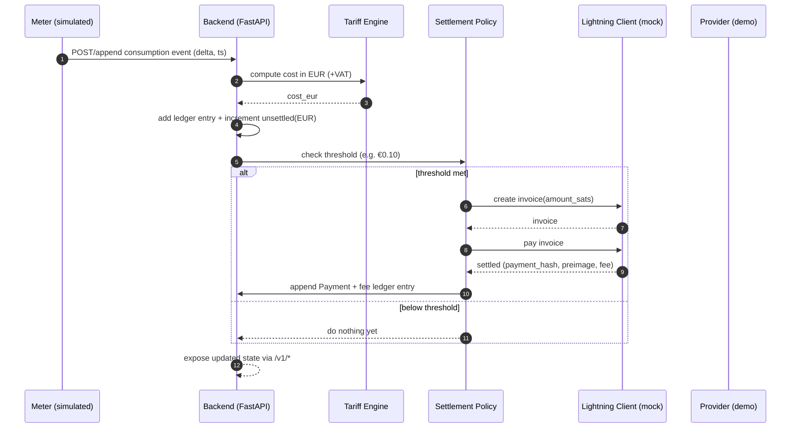
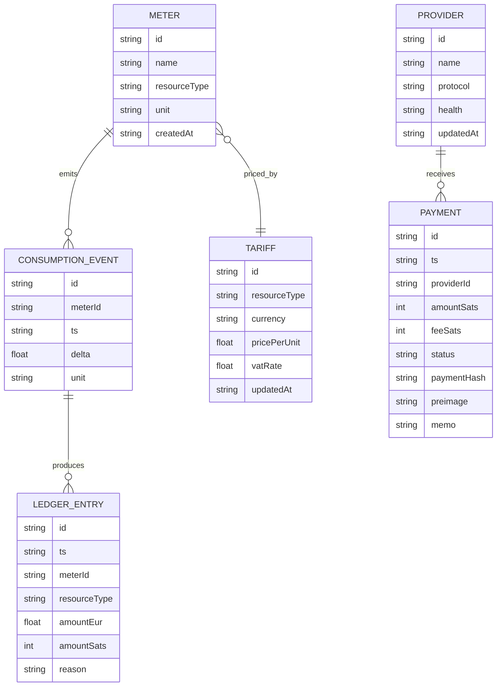

# AI Consumption Payment (Lightning)

Full-stack demo: real-time utility consumption → tariff calculation → automatic micro-settlement over Bitcoin Lightning.

The UI is intentionally styled like [`402index.io`](https://402index.io/) (stats cards, protocol tabs, directory tables, health badges).

## Problem & goal (Hack-Nation Challenge 2)

In Germany, many tenants pay **Warmmiete** (rent + estimated utilities) and only receive a true-up invoice once per year. This project demonstrates a more transparent alternative:

- **Smart-meter-like ingestion** of electricity/gas/hot-water/cold-water usage
- **Deterministic tariffing** (auditable rules, not “AI math”)
- **Automatic micro-settlement** over **Bitcoin Lightning** (push payments)
- **Live UI** that makes consumption and payments visible in real time

## What runs today

This repo includes a **Python FastAPI** server that serves:

- **Frontend**: `GET /` (HTML + Tailwind CDN + JS polling)
- **Backend API**: `GET /v1/*` (meters, providers, stats, payments, ledger)
- **Simulation**: meter events + auto-settlement loop (mock Lightning) on an interval

## Architecture

### High-level components

```mermaid
flowchart LR
  A[Smart meters / Meter gateway<br/>simulated] -->|consumption events| B[Backend API (FastAPI)]

  subgraph B[Backend API (FastAPI)]
    B1[Consumption store]
    B2[Tariff engine<br/>EUR cost]
    B3[Settlement policy<br/>threshold/time]
    B4[Ledger + payments log]
    B5[Lightning client<br/>mock now, LND/CLN later]
  end

  B -->|JSON /v1/*| C[Frontend UI<br/>402index-like]
  B5 -->|invoice + pay| D[Utility provider wallet/node<br/>mocked in MVP]
  B4 -->|audit trail| C
```

### “Pay-as-you-go” settlement flow (Lightning push payments)



### Data model (what gets recorded)



## Local dev (recommended)

Prereqs: Python 3.8+

```bash
cp .env.example .env
python3 -m pip install -r requirements.txt
python3 -m uvicorn server.app:app --reload --port 4000
```

Open:

- App: `http://localhost:4000/`
- Health: `http://localhost:4000/health`
- Stats: `http://localhost:4000/v1/stats`

## Configuration

The app reads environment variables (see `.env.example`):

- **`PORT`**: server port (default `4000`)
- **`SIMULATION_ENABLED`**: generate meter events automatically (`true|false`)
- **`SIMULATION_TICK_MS`**: simulator tick interval (e.g. `1500`)
- **`SETTLEMENT_THRESHOLD_EUR`**: trigger payment once unsettled EUR ≥ threshold (e.g. `0.10`)
- **`BTC_EUR_RATE`**: fixed conversion rate for demo (e.g. `60000`)

## API (MVP)

Base path: `/v1`

- **`GET /v1/stats`**: homepage KPIs + provider health summary + unsettled EUR
- **`GET /v1/providers`**: providers list (health, protocol)
- **`GET /v1/meters`**: meters directory
- **`GET /v1/tariffs`**: tariffs (EUR pricing rules)
- **`GET /v1/consumption?limit=200`**: recent consumption events
- **`GET /v1/ledger?limit=200`**: audit ledger entries
- **`GET /v1/payments?limit=200`**: payment history (mock Lightning)
- **`POST /v1/ingest`**: ingest a consumption event

Example:

```bash
curl -s http://localhost:4000/v1/stats
curl -s http://localhost:4000/v1/payments
```

## Lightning integration status

Today the Lightning layer is **mocked** (`server/lightning_mock.py`) so the demo works locally without a node.

To move from mock → real Lightning:

- **LND**: generate invoice via `lnrpc` (gRPC / REST) and pay via `SendPaymentV2`
- **Core Lightning**: generate invoice via `invoice` and pay via `pay`

The code is structured so the Lightning client can be swapped without changing the settlement policy and ledger.

## Notes

- The `apps/*` Node scaffold is optional; your Cursor environment currently doesn’t include npm/pnpm, so the Python server is the working full-stack path.

